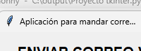
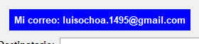
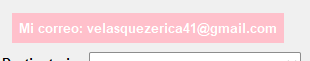
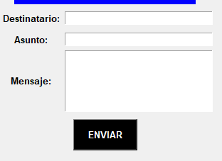
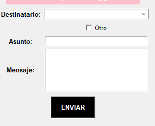

#INFORME DEL CORREO VIA GMAIL

##Introduccion

##El informe va explicar sobre los cambios que realize lo unico que no va explicar es sobre la imagen nueva importada porque por más que lo tenga instalado el pillow no me deja ejecutarlo y intente en varias computadoras 

##Cambios 

##Primero cambie el nombre al titulo 

##Antes:

##Despues:

###Luego cambie el color a la etiqueta del correo personal y el gmail
###Antes:

###Despues:

###Luego realize el codigo para el menú opcional 
###El codigo lo realize con la ayuda de unos videos en youtube y chgpt
###hacuiendo uso del Combobox y Checkbutton
###Como estaba antes:

###Despues del agregar el codigo:

###Finalmente como quedo:

